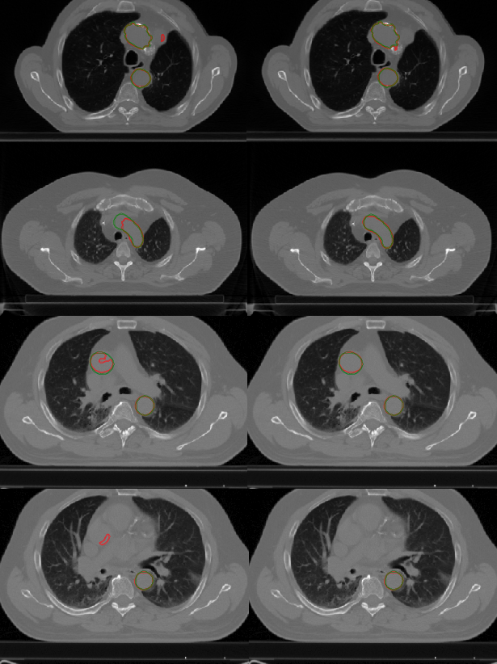

# GEOMETRICALLY-CONSTRAINED-DEEP-NETWORK
---
## Overview
We have introduced a new loss function which incorporates geometrical constraints during training of CNN. This function is built on a Dice term encouraging intensity pairing, a weighted total variation term inducing edge alignment, a piecewise-constant Mumford-Shah (MS)-like term enforcing intensity homogeneity, and an area penalisation. The resulting minimisation problem is split into two sub-problems so as to be solved using the ADMM algorithm. The optimisation of the first sub-problem is based on SGD, while that of the second one is performed using Douglas-Rachford algorithm.

## Data
The original dataset is downloadable at [codalab](https://competitions.codalab.org/competitions/21145). For now, we have focused on the segmentation of the aorta.

## Results 
Segmentation on test images gives better results for the constrained case compared to the unconstrained one: 

|:--:| 
| *Comparaison between automatic segmentation (red) and ground truth (green) for unconstrained case (left column) and the constrained case (right column).* |
